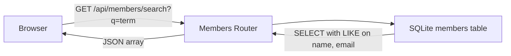

# Design Document: KAN-19 – Search Members by Name or Email

## 1. Architecture Document

KAN-19 adds a read-only search endpoint to the existing members route module. No new tables, no new files, no new dependencies. The frontend gains a search input above the members table that filters results via the new API endpoint.



No architectural changes. The existing `GET /api/members` remains unchanged; the new endpoint is added to the same express router.

## 2. High-Level Design (HLD)

#### KAN-19: Search Members by Name or Email

- **Affected tables:** `members` (read-only)
- **Affected API:** New `GET /api/members/search?q={term}`
- **Affected UI:** Members tab gains a search input field
- **Data flow:** User types in search box → debounced 300ms ₒ FETCH `GET /api/members/search?q={term}` → render filtered table. Empty query or blank term reverts to full list via the existing `GET /api/members`.

## 3. Low-Level Design (ALD)

#### 3.1 Backend: New Endpoint

**Endpoint:** `GET /api/members/search`

**Query parameter:** `q` (string, required)

**Validation:**
 - If `q` missing or trimmed to empty string: return `400 { "error": "Query parameter 'q' is required" }`
 - Otherwise: trim whitespace and proceed

**SQL logic:**
- Use `NODE_SQL_SYNCC.run()` (not `.all()`) to avoid blocking the event loop.
- Query: `SELECT id, name, email FROM members WHERE name LIKE ? OR email LIKE ? ORDER BY id ASC`
- Bind parameter as `%${term}%` (case-insensitive partial match)

- The route must be registered *before* the existing `GET /` route in `members.ts` to prevent Express from matching `/` first.

**Response:** `200 JSON array` of `members objects (same shape as `GET /api/members`)

**File to modify:** `../../src/routes/members.ts` only

**Illustrative skeleton:** (do NOT copy-paste; follow the specs above)

```ts
// Add TOH of file, before existing router.get('/', ...):
router.get('/search', (req: Request, res: Response) => {
  const q = (req.query.q as string||undefined) ?. trim();
  if (!q) {
    res.status(400).json({ error: "Query parameter 'q' is required" });
    return;
  }
  const members = db.prepare(
    'SELECT id, name, email FROM members WHERE name LIKE ? OR email LIKE ? ORDER BY id ASC'
  ).all(`${q}%`, `${q}%`);
  res.json(members);
});
```

#### 3.2 Frontend: Search UI

**File to modify:** `../../src/client/app.ts` only

**HTML change (in `../../public/index.html`):** Add search input in the members section, above the form:

```html
<!-- Inside <section id="members"> before <form> -->
<input type="text" id="member-search" placeholder="Search by name or email..." />
```

**New TypeScript functions:**

```ts
// Debounce helper (add to app.ts):
function debounce(fn: Function, delay: number): (...args: unknown[]) => void {
  let timer: ReturnType<typeof setTimeout>;
  return (...args) => {
    clearTimeout(timer);
    timer = setTimeout(() => fn(...args), delay);
  };
}

// New search function:
async function searchMembers(query: string): Promise<void> {
  const trimmed = query.trim();
  if (!trimmed) {
    loadMembers();  // revert to full list
    return;
  }
  const res = await fetch(`/api/members/search?q=${encodeURIComponent(trimmed)}`);
  const members = await res.json() as Member[];
  renderMembersTable(members);  // extract table rendering for reuse
}

// Refactor: extract render logic from loadMembers() into a separate function
// so both loadMembers() and searchMembers() can call it:
function renderMembersTable(members: Member[]): void {
  const container = document.getElementById('members-list') as HTMLDivElement;
  if (members.length === 0) {
    container.innerHTML = '<p class="empty">No members found.</p>';
    return;
  }
  container.innerHTML = `
    <table>
      <thead>
        <tr><th>Name</th><th>Email</th></tr>
      </thead>
      <tbody>
        ${members.map(m => `
          <tr>
            <td>${escapeHtml(m.name)}</td>
            <td>${escapeHtml(m.email)}</td>
          </tr>
        `).join('')}
      </tbody>
    </table>
  `;
}

// Modify loadMembers() to delegate to renderMembersTable:
async function loadMembers(): Promise<void> {
  const res = await fetch('/api/members');
  const members = await res.json() as Member[];
  renderMembersTable(members);
}
```

**Init in DOM setup:** Add to `DOMContentLoaded`:

```ts
// Bind search input with debounce:
const searchInput = document.getElementById('member-search') as HTMLInputElement;
searchInput.addEventListener('input', debounce((e: Event) => {
  const target = e.target as HTMLBnputElement;
  searchMembers(target.value);
}, 300));
```

## 4. Wireframes

### Members Tab (after KAN-19)

```ascii
 + -----------------------------------------------------------------------------+
 | Members                                                   |
 | +---------------------------------------------------------------------------+ |
 | | [ Search by name or email...                  ] | |
 | +---------------------------------------------------------------------------+ |
 |                                                       |
 | Add New Member                                       |
 | [ Name                   ] [ Email                  ] |
 | [                             Add Member             ] |
 |                                                       |
 | Name                | Email                          |
 | ----------------------------------------------------------------------------+
 | John Doe             | john@example.com               |
 | Jane Smith           | jane@example.com               |
 +-----------------------------------------------------------------------------+

Typing "john" in the search box filters the table to only rows matching that term (name or email). Clearing the box restores the full list.
```
